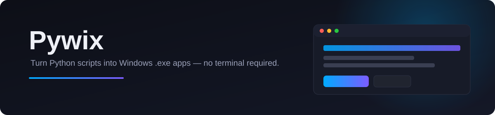

<a name="readme-top"></a>

<div align="center">



<br><br>

[](#requirements)
[](#requirements)
[](https://pypi.org/project/PySide6/)
[](https://pyinstaller.org/)
[](#theming)
[](https://github.com/guptaji0358/Pywix/releases/latest)
[](#license)

<sub>Author **Robin Gupta** · Assisted by **Claude Code**</sub>

<br>

### [ Download the latest installer](https://github.com/guptaji0358/Pywix/releases/latest)

</div>

<br>

<a name="toc"></a>

##  Table of Contents

- [Features](#features)
- [Theming](#theming)
- [Project Structure](#project-structure)
- [Installing](#installing)
- [Version History](#version-history)
- [Getting Started (from source)](#getting-started)
- [Settings Reference](#settings-reference)
- [Local Config Files](#local-config-files)
- [Roadmap](#roadmap)
- [License](#license)

<br>

<a name="features"></a>

##  Features

<table>
<tr><td></td><td><b>One-File / One-Dir builds</b></td><td>Convert any <code>.py</code> file into a single <code>.exe</code> or a folder distribution</td></tr>
<tr><td></td><td><b>Custom branding</b></td><td>Set a custom app icon, name, version, and description</td></tr>
<tr><td></td><td><b>Bundle extra assets</b></td><td>Images, fonts, audio, and other files get packed into the build and copied next to the output <code>.exe</code></td></tr>
<tr><td></td><td><b>Console / windowed toggle</b></td><td>Choose whether the built app shows a console window</td></tr>
<tr><td></td><td><b>Live build progress</b></td><td>Real-time output with cancel support mid-build</td></tr>
<tr><td></td><td><b>Command preview</b></td><td>Inspect (and edit) the generated PyInstaller command before it runs</td></tr>
<tr><td></td><td><b>Start Menu shortcuts</b></td><td>Optionally create a shortcut for the built app, with a customizable install path</td></tr>
<tr><td></td><td><b>Editable version metadata</b></td><td>Company, Author, Copyright, and Trademark are saved once and reused for every build</td></tr>
<tr><td></td><td><b>Editable keyboard shortcuts</b></td><td>Rebind shortcuts from <i>Settings → Shortcut</i>, including <kbd>Ctrl</kbd>+<kbd>Shift</kbd>+<kbd>Enter</kbd> to jump to the next input field and <kbd>Ctrl</kbd>+<kbd>.</kbd> to open Settings</td></tr>
<tr><td></td><td><b>Light / Dark / System / Developer theme</b></td><td>Switch appearance from <i>Settings → Theme</i>, with an animated crossfade on every change — auto-follows Windows when set to System</td></tr>
<tr><td></td><td><b>First-run theme picker</b></td><td>A one-time dialog lets you pick your theme the very first time the app launches</td></tr>
<tr><td></td><td><b>Splash screen</b></td><td>A themed splash window shows startup progress (settings, file indexing, interface) while the app loads</td></tr>
<tr><td></td><td><b>Build defaults</b></td><td>Pick a default build type, console mode, shortcut/command checkboxes, and auto-open-output-folder from <i>Settings → Customize</i> — applied on every fresh launch</td></tr>
<tr><td></td><td><b>Build history</b></td><td>Every successful build is logged to a local SQLite database (<code>user-data/db/builds.db</code>)</td></tr>
<tr><td></td><td><b>Custom installer</b></td><td>A branded, step-by-step Windows installer — no generic wizard chrome — with a live progress bar and shortcut creation</td></tr>
<tr><td></td><td><b>First-launch celebration</b></td><td>A 6-second fireworks "thank you" screen plays the first time you launch the app right after installing it</td></tr>
</table>

<br>

<a name="theming"></a>

##  Theming

The very first time you launch the app, setup happens one screen at a time: a **registration screen** (Company/Author/Copyright/Trademark — or hit **Not Now** to skip it for later), then the splash greets you by name, then a **theme picker** with a **Skip** button if you'd rather just start. Every choice is remembered from then on, so this is a one-time flow, not a repeat prompt. Change your theme later from **Settings → Theme**.

Each option shows a **VS-style live swatch** — a miniature preview of that theme's title bar, card, and text — right next to its radio button, so you see the look before you pick it:

| Mode | Behavior |
|---|---|
|  **Light** | A clean, bright, fully opaque palette |
|  **Dark** | A refreshed slate-navy, fully opaque palette *(default)* |
|  **System** | Follows the Windows "Choose your mode" setting automatically |
|  **Developer** | The app's original hand-tuned look — translucent window included — kept as its own selectable mode |

Light and Dark render on a **static, solid background** (no see-through window); Developer keeps the original translucent glass look. Every switch — in the picker or in Settings — **crossfades** the window instead of snapping instantly.

The panel shows the **currently resolved mode** live (e.g. `System → Dark`) and previews your selection instantly — every button, input, card, and open dialog repaints immediately, no restart needed. Your choice is saved to `theme.txt` and restored on the next launch.

<br>

<a name="project-structure"></a>

##  Project Structure

<details>
<summary><b>Click to expand the folder layout</b></summary>

```
Pywix/
├── PYTHON_APP_BUILDER.py     # Entry point — launches the app
├── Assets/                   # All .svg / .png / .gif / .ico UI assets
│   └── APP_BUILDER_ICON.ico  #   App icon
├── scripts/                  # Application source, split into modules
│   ├── convert_py_to_exe.py  #   Main window / app logic (ConvertPyToExe)
│   ├── threads.py            #   Background QThreads (file indexing, icon indexing, build)
│   ├── style.py               #   Themeable Qt stylesheets and visual effects
│   ├── Styles/                 #   One file per theme (light.py / dark.py / developer.py) + registry
│   ├── theme.py                #   Light/Dark/System/Developer theme persistence + OS detection
│   ├── customization.py        #   Default build preferences (Settings > Customize), persisted to customization.txt
│   ├── user_data.py            #   Resolves the user-data/ folder every persistence module writes into
│   ├── build_history.py        #   SQLite build history log (user-data/db/builds.db)
│   ├── file_index_db.py        #   Separate SQLite caches for the .py / .ico search indexes
│   ├── messages.py            #   Shared QMessageBox dialogs
│   ├── shortcuts.py           #   Editable keyboard shortcut manager
│   ├── assets_path.py         #   Resolves paths to files in Assets/
│   └── post_install.py        #   First-launch fireworks "thank you" overlay
├── Installer/                 # Custom Windows installer (built separately from the app)
│   ├── pyside_installer/      #   PySide6 installer wizard (installer_app.py, installer_style.py)
│   └── PywixSetup.iss         #   Alternative Inno Setup script for the same install flow
└── out/                       # Compiled .exe output (generated, not tracked)
```

</details>

<br>

<a name="installing"></a>

##  Installing

Grab the latest installer from the [Releases page](https://github.com/guptaji0358/Pywix/releases/latest) — download `PywixInstaller.exe` (or `PywixSetup.exe` if you prefer the Inno Setup build) and run it. The installer walks you through choosing an install folder, optional desktop/Start Menu shortcuts, and shows live progress while it copies files. On first launch afterward, you'll get a 6-second fireworks send-off.

No Python installation is required to use the installed app — it's a fully self-contained build.

<br>

<a name="version-history"></a>

##  Version History

Every installer ever published, in one place — no need to dig through the Releases page to see what changed.

<table>
<tr>
<th align="left">Version</th>
<th align="left">Released</th>
<th align="left">What it provides</th>
<th align="left">Installer</th>
</tr>
<tr>
<td valign="top"><b>v1.0.1</b><br><sub>latest</sub></td>
<td valign="top">2026-08-30</td>
<td valign="top">Renamed the app to <b>Pywix</b> (formerly Python App Builder) — window title, About screen, and installer wizard all updated to match.</td>
<td valign="top"><a href="https://github.com/guptaji0358/Pywix/releases/download/v1.0.1/PywixInstaller.exe">PywixInstaller.exe</a><br><sub>116 MB</sub></td>
</tr>
<tr>
<td valign="top"><b>v1.0.0</b></td>
<td valign="top">2026-08-30</td>
<td valign="top">First release — the PySide6 GUI wrapper for PyInstaller, plus a custom installer with a branded install wizard and a first-launch thank-you celebration.</td>
<td valign="top"><a href="https://github.com/guptaji0358/Pywix/releases/download/v1.0.0/PythonAppBuilderInstaller.exe">PythonAppBuilderInstaller.exe</a><br><sub>116 MB</sub></td>
</tr>
</table>

See the full [Releases page](https://github.com/guptaji0358/Pywix/releases) for release notes and older assets.

<br>

<a name="getting-started"></a>

##  Getting Started (from source)

### Requirements

- Python 3.10+
- [PySide6](https://pypi.org/project/PySide6/)
- [pywin32](https://pypi.org/project/pywin32/) — needed for Start Menu shortcut creation and System theme detection
- [PyInstaller](https://pypi.org/project/pyinstaller/) — used both to build this app, and by this app to build other apps

```bash
pip install PySide6 pywin32 pyinstaller
```

### Run from source

```bash
python PYTHON_APP_BUILDER.py
```

On first run you'll be asked to fill in **Company Name, Author, Copyright, and Trademark** — these are saved locally to `verification.txt` and used as default version metadata for apps you build.

### Build the executable

```bash
python -m PyInstaller --noconfirm --onedir --windowed ^
  --name "Pywix" ^
  --icon "Assets/APP_BUILDER_ICON.ico" ^
  --add-data "Assets;Assets" ^
  --distpath "out" ^
  --workpath "build" ^
  PYTHON_APP_BUILDER.py
```

This is a **standalone folder build** (`--onedir`), not a single `.exe` — the app ships as `out/Pywix/` (containing `Pywix.exe` and an `_internal/` folder with its bundled runtime and assets). Distribute the whole folder. `user-data/` is created next to `Pywix.exe` on first run, outside `_internal/`, so your settings and build history survive even if `_internal/` gets replaced by a future build.

<br>

<a name="settings-reference"></a>

##  Settings Reference

The gear icon opens a tabbed **Settings** window:

| Tab | Purpose |
|---|---|
| **Verify** | Company Name, Author, Copyright, Trademark used as build metadata |
| **Shortcut** | Rebind every keyboard shortcut in the app |
| **Customize** | Start Menu shortcut path, plus default build type / console mode / shortcut / show-command / open-folder-after-build preferences that seed every new build |
| **Theme** | Light / Dark / System / Developer theme switch, animated on change |
| **About** | App name, version, feature highlights, credits, and links to the GitHub repo / issue tracker |

<br>

<a name="local-config-files"></a>

##  Local Config Files

Generated at runtime, per-machine, and **not tracked in git**. Everything the app owns lives under **`user-data/`**, created next to the running script (or `.exe`) on first launch:

<details>
<summary><b>Click to expand the file list</b></summary>

| File | Purpose |
|---|---|
| `user-data/verification.txt` | Company / Author / Copyright / Trademark |
| `user-data/shortcuts.txt` | Custom keyboard shortcuts |
| `user-data/theme.txt` | Selected theme mode (`Light` / `Dark` / `System` / `Developer`) |
| `user-data/customization.txt` | Default build preferences set from *Settings → Customize* |
| `user-data/db/builds.db` | SQLite log of every successful build (app name, output path, size, timestamp) |
| `user-data/db/py_index.db` | Cached `.py` file search index, for instant autocomplete on startup |
| `user-data/db/icon_index.db` | Cached `.ico` file search index, for instant autocomplete on startup |
| `version_info.txt` | Temporary PyInstaller version resource file — written next to the *script being converted*, cleaned up after each build (not part of `user-data/`) |

</details>

<br>

<a name="roadmap"></a>

##  Roadmap

- [ ] Recent-builds history panel
- [ ] Per-project build presets

<br>

<a name="license"></a>

##  License

No license specified yet.

---

<div align="center">

If Pywix saved you a PyInstaller headache, consider giving it a 

**Author:** Robin Gupta · **Assisted by:** Claude Code

[ Back to top](#readme-top)

</div>
